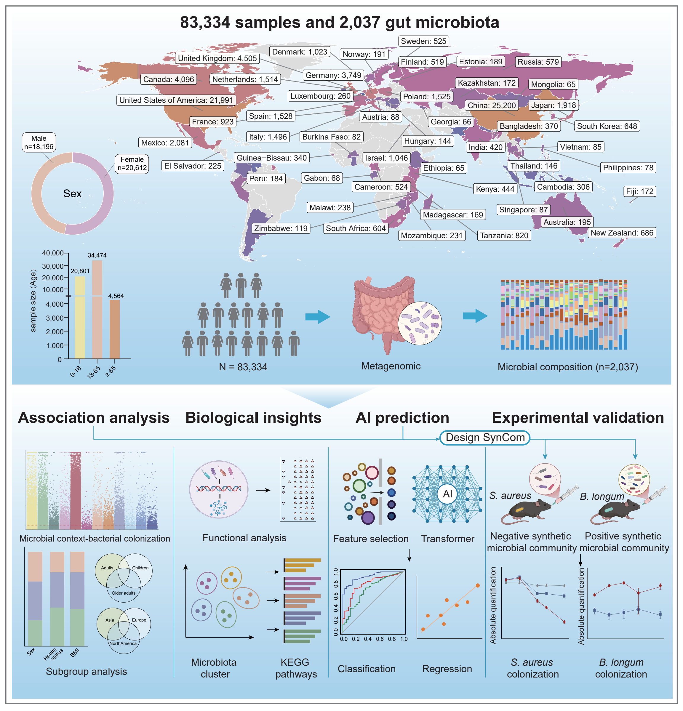
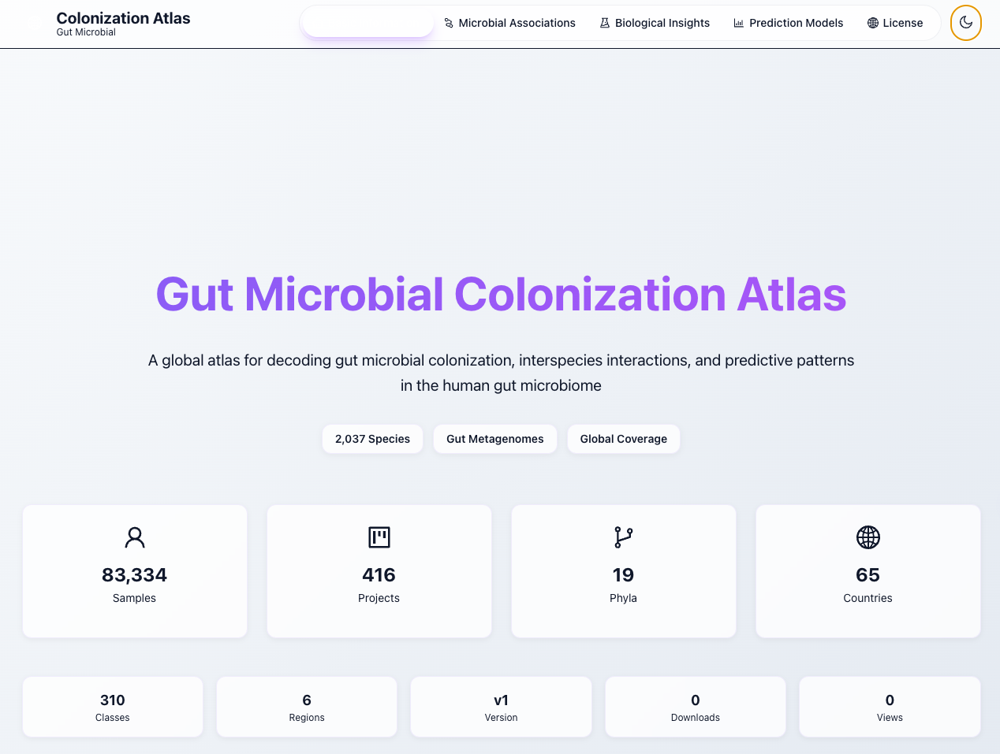

# Gut Microbial Colonization Atlas

## Description

This repository contains Python code for the prediction analyses in the **Gut Microbial Colonization Atlas**. The workflow uses the abundance profiles of other gut microbial taxa to predict the presence and abundance of a target taxon, combining tree-based feature selection, Transformer models, and bootstrap evaluation.

*Figure 1. Study overview.*

## Introduction

The Gut Microbial Colonization Atlas brings together **83,334 gut metagenomic samples** from **416 projects** across **65 countries**, covering **2,037 microbial species**. It provides a resource for exploring microbial colonization, associations among taxa, and predictive patterns in the human gut microbiome.

Two prediction tasks are implemented: classification of microbial presence and regression of log-transformed abundance. For each target, features are selected within the corresponding training fold using LightGBM, XGBoost, and CatBoost. Five-fold predictions are evaluated using ROC AUC for classification and Pearson correlation among target observations for regression, with 1,000 bootstrap resamples for confidence intervals.

## Code structure

| Directory | Contents |
| --- | --- |
| [`scripts/S1_FS`](scripts/S1_FS) | Fold-specific feature ranking using LightGBM, XGBoost, and CatBoost |
| [`scripts/S2_Model`](scripts/S2_Model) | Transformer training for presence classification and abundance regression |
| [`scripts/S3_Pred`](scripts/S3_Pred) | Prediction export using each fold's model and corresponding features |
| [`scripts/S4_Eval`](scripts/S4_Eval) | ROC AUC, Pearson correlation, and bootstrap confidence intervals |
| [`Utility`](Utility) | Supporting data-processing, training, and statistical functions |

## Software requirements

The training scripts target Linux. Transformer training uses NVIDIA GPUs with **PyTorch 2.5.1 and `pytorch-cuda=12.1`**.

| Component | Version |
| --- | --- |
| Python | 3.11.10 |
| NumPy | 2.0.1 |
| pandas | 2.2.3 |
| SciPy | 1.15.2 |
| scikit-learn | 1.6.1 |
| LightGBM | 4.6.0 |
| XGBoost | 3.0.0 |
| CatBoost | 1.2.8 |
| PyTorch | 2.5.1 |
| PyTorch CUDA | 12.1 |
| DeepSpeed | 0.16.4 |

## Assets and usage

The workflow starts from three prepared CSV files: `AbundanceData_preprocessed.csv` (sample-by-taxon abundances), `PhenotypeData.csv` (sample IDs and fold assignments), and `Analyst_summary.csv` (taxon names and analysis types).

## License

Unless otherwise noted, original content in this repository is licensed under the [Creative Commons Attribution-NonCommercial-ShareAlike 4.0 International License](https://creativecommons.org/licenses/by-nc-sa/4.0/).

Third-party code and dependencies remain subject to their respective licenses.

## Website

**Website:** [gut-colonization-atlas.com](https://gut-colonization-atlas.com)
